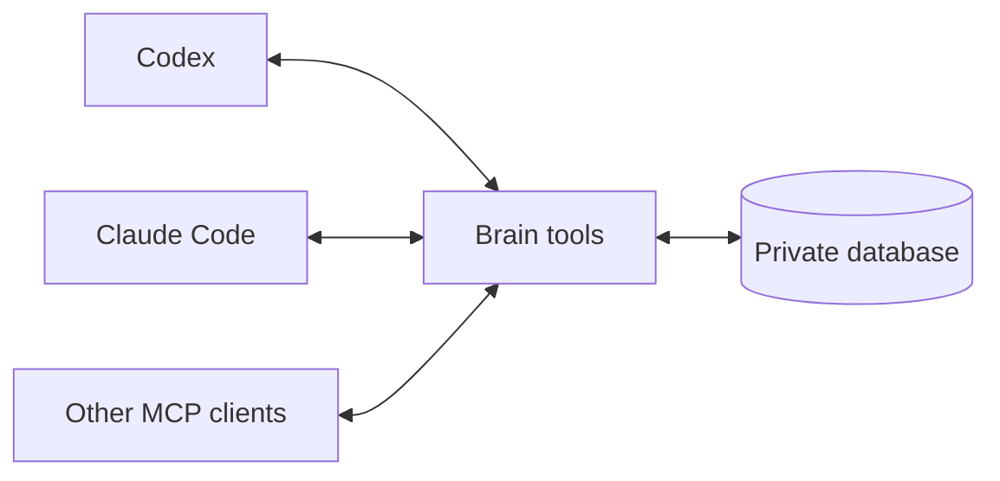

# Berry Brain

Shared, private memory for AI agents. Use it with Codex, Claude Code, or another
client that supports MCP, the Model Context Protocol.

The brain saves task state and checked results. Agents can use this memory to
resume work and test lessons from past tasks. Each new installation starts empty.

## How it works



1. An agent reads saved state and finds lessons that match the task.
2. It checks current facts and does the work.
3. It saves the result and its evidence.
4. It can propose a lesson and test it on later tasks.

A lesson needs helpful results from two new tasks before normal recall can return
it. Each test must have distinct evidence. Harmful feedback stops reuse.

Memory changes the context given to the model. It does not train the model or
ensure better answers. Saved text is evidence. It cannot grant permission or
replace instructions.

## Set it up

You need Python 3.11 or later with SQLite FTS5 support. Install your AI clients
first. The Codex command must be on your `PATH`.

Download or clone this repository. Open a terminal in its directory.

On Linux or macOS:

```sh
python3 -m venv .venv
.venv/bin/python -m pip install .
.venv/bin/berry-brain-configure codex --local
.venv/bin/berry-brain-configure claude --local
```

Run the setup command for each client you use. For Windows commands, see
[Setup and data](docs/usage.md#install).

Reopen the client sessions. Ask an agent to recall a task, then save a checked
result. Both clients use the same local database.

Setup adds the brain tools and a short reminder to the client's global
instructions. It does not need a separate brain account, model key, or server.

Keep `.venv` at this path. After an update, run the install and setup commands
again. Saved data stays outside the source directory.

## Read more

| Guide | What it covers |
| --- | --- |
| [Setup and data](docs/usage.md) | Client setup, data paths, privacy, backup, and faults |
| [Learning and skills](docs/learning.md) | Recall, evidence, lesson tests, and skill updates |
| [Development](docs/development.md) | Source files, tests, host access, and upgrades |

Local mode makes no network requests. The AI client can send recalled text to its
model provider. Keep private data and credentials out of Git.

Released under the [MIT license](LICENSE).
