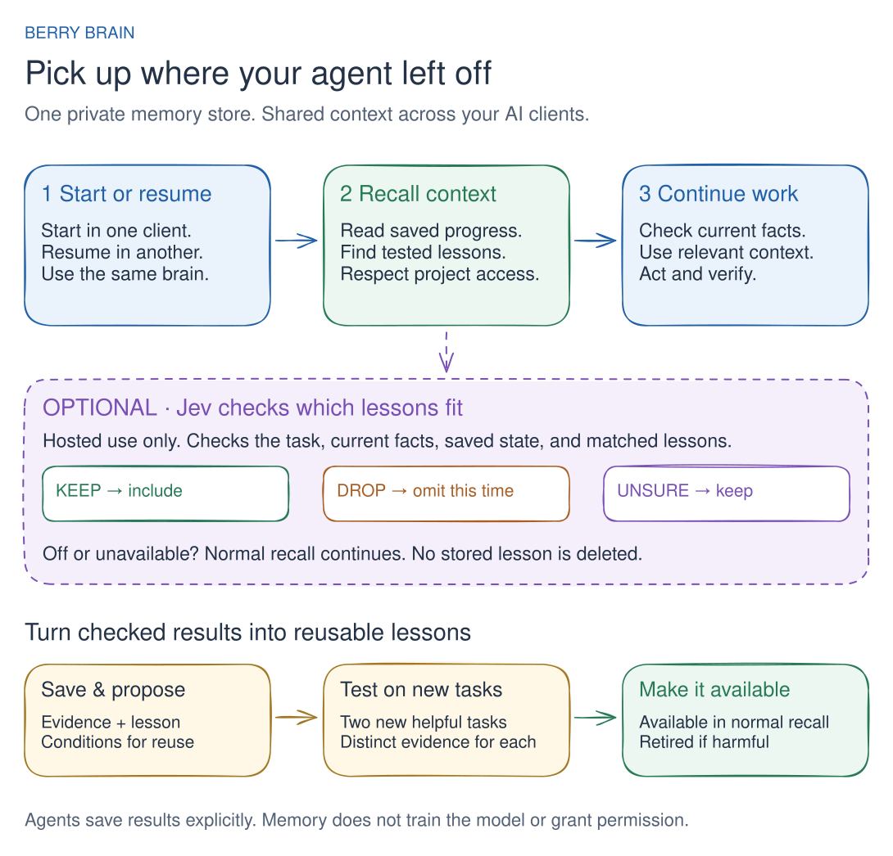

# Berry Brain

Pick up where your AI agent left off.

Berry Brain keeps task progress, checked results, and tested lessons in one
private memory store. Use it with Codex, Claude Code, or another client that
supports MCP, the Model Context Protocol.

For example, start a bug fix in Codex. Save what failed, what passed, and the next
step. Later, Claude Code can recall that state and continue after checking that
the facts still hold. Both clients must connect to the same brain and have access
to the project. Each new installation starts empty.

| What you need | What the brain provides |
| --- | --- |
| Resume a task | A saved goal, progress, and next step |
| Switch AI clients | Shared project memory across connected clients |
| Reuse a checked method | Lessons with conditions and links to past results |
| Keep context relevant | Keyword search, with an optional model relevance check |

## How it works



[Open the full-size diagram](docs/images/how-it-works.svg) ·
[Editable Excalidraw source](docs/images/how-it-works.excalidraw)

1. **Recall.** The agent asks for saved task state and lessons that match its
   current task. Access rules limit which project records it can read.
2. **Check and act.** The agent checks the memory against current facts, then
   does the work. An optional relevance check can filter the returned lessons.
3. **Save the outcome.** The agent records the result, its evidence, and the next
   step. This gives a later session a place to resume.
4. **Test what transfers.** A useful result can become a proposed lesson with
   clear conditions for reuse.

A proposed lesson stays out of normal recall until clients report helpful results
from two new tasks, each with distinct evidence. Harmful feedback stops reuse.
These reports are a reuse rule, not independent proof that the lesson is correct.

Memory changes the context given to the model. It does not train the model or
ensure better answers. Saved text is evidence. It cannot grant permission or
replace instructions.

## Where Jev fits

A keyword match can find a lesson that no longer fits. For example, a lesson about
waiting for a running job is not useful when current facts say the job is complete.

The **same optional lesson selector** works with local storage and server setups.
It asks an evaluation model, such as Jev, whether each matched lesson fits the task
and current facts. You choose the provider endpoint, model, and private credential
reference. No Berry server is required.

| Jev's choice | What the agent receives |
| --- | --- |
| Keep | The lesson stays in this response |
| Drop | The lesson is left out of this response; it stays stored |
| Uncertain | The lesson stays so the agent can check it |

If selection is off, fails, or returns an invalid reply, normal recall remains
available. If saved state changes during the check, the brain uses fresh normal
recall. Jev cannot grant access, promote a lesson, or find lessons that keyword
search missed. The agent still needs to check current facts.

**Configure once, use one selection path.** The built-in HTTP adapter supports the
TypeSafe-compatible evaluation API, including TypeSafe and Vercel AI Gateway.
Other APIs connect through the same small evaluator interface. Berry's own setup
uses its LLM Gateway adapter; provider keys stay in that Gateway.

Follow [model setup](docs/usage.md#optional-model-selection) to enable selection.
Without model configuration, local Brain makes no network requests.

When selection is enabled, matched lesson texts and conditions, the query, supplied
current context, and saved checkpoint go to your configured evaluator. This adds
a network call and model usage. It does not guarantee better answers, lower cost,
or faster tasks.

## Set it up

You need Python 3.11 or later with SQLite FTS5 support. Install your AI clients
first. The Codex command must be on your `PATH`.

Download or clone this repository. Open a terminal in its directory.

On Linux or macOS:

```sh
python3 -m venv .venv
.venv/bin/python -m pip install .
.venv/bin/berry-brain-configure codex --local
.venv/bin/berry-brain-configure claude --local
```

Run the setup command for each client you use. For Windows commands, see
[Setup and data](docs/usage.md#install).

Reopen the client sessions. Ask an agent to recall a task, then save a checked
result. Both clients use the same local database.

Setup adds the brain tools and a short reminder to the client's global
instructions. Basic memory needs no separate brain account, model key, or server.
Optional model selection uses your own provider configuration.

Keep `.venv` at this path. After an update, run the install and setup commands
again. Saved data stays outside the source directory.

## Read more

| Guide | What it covers |
| --- | --- |
| [Setup and data](docs/usage.md) | Client setup, data paths, privacy, backup, and faults |
| [Learning and skills](docs/learning.md) | Recall, evidence, lesson tests, and skill updates |
| [Development](docs/development.md) | Source files, tests, host access, and upgrades |

Local mode makes no network requests unless you configure model selection.
The AI client can send recalled text to its model provider. Keep private data and
credentials out of Git.

Released under the [MIT license](LICENSE).
