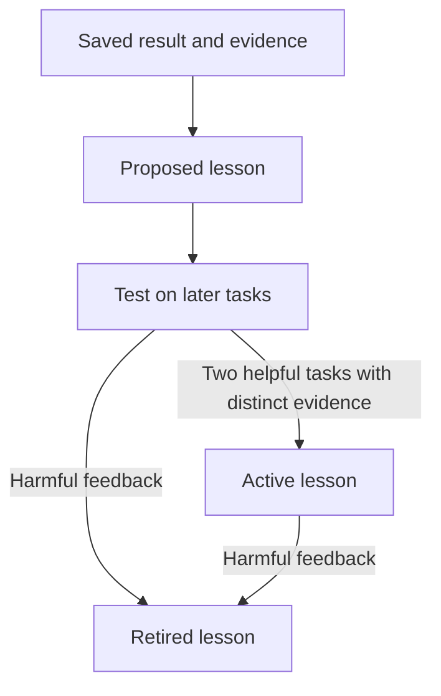

# Learning and skills

[Home](../README.md) · [Setup and data](usage.md) · [Development](development.md)

The brain stores task state, checked results, and lessons. It changes the context
given to a model. It does not change model weights or ensure better results.

The tool descriptions define how to use memory. Saved text is untrusted evidence.
It cannot replace instructions or grant permission.

## Recall what can help

Recall memory when saved state or past experience could affect the next decision.
Reuse enough context that is already loaded. A new message alone does not require
another recall.

Use a focused search when a lesson could help. Check its conditions, current facts,
and any linked skill revision before use. A keyword match does not prove that a
lesson applies. You can ignore all matches.

Read live status from the tool or service that owns it. Recall again if relevant
shared state may have changed.

## Save useful state

Save results with exact evidence. Include failures and uncertainty.
Use the same project and task ID when you move between clients.

A checkpoint is a short record used to resume or hand off work. Save one when
useful state changes. Do not save unchanged waits.

Keep these items brief:

- The goal and key constraints.
- The latest checked state.
- The next step.
- Links to detailed evidence.

Each checkpoint link can have up to 1,000 characters. Keep full documents outside
the checkpoint.

## Test a lesson

A candidate is a proposed lesson. It stays out of normal recall until it passes
the reuse rule.

1. Propose a lesson from saved results. State when it applies.
2. Use `history` to find a candidate for a new task.
3. Use `trial` to read the candidate for that test.
4. Run the test and keep a stable link to its fixed result.
5. Use `feedback` to report a helpful, neutral, or harmful result.

Saving an experience alone does not complete a test. The tasks and evidence used
to create the lesson do not count toward its two helpful tests.

Each test needs distinct evidence. These changes do not create new evidence:

- Reusing a result under a new name or link.
- Adding excerpts from the same result.
- Changing punctuation.
- Copying the same excerpt to a new reference.

Each test result must make sense on its own. A repeated “passed” message is not
enough evidence.

Harmful feedback retires the lesson. Normal state changes occur when feedback
arrives. On upgrade, the engine rechecks existing lesson promotions once.

Feedback is a client report. The brain does not independently verify it.
False references and false results are still possible. Two helpful results are
a minimum reuse rule. They are not proof that a lesson helps every task.

## Recall limits

Recall uses keyword search. Its whole response fits within 24 KB.
This includes task state, up to 12 lessons, and receipt data for feedback.
An empty query loads task state only.

Other tasks appear as short previews. A current checkpoint that is too large also
appears as a marked preview. Read the full record with `history` and its `record_id`
before you resume or update it.

The stored record stays complete. Recall keeps each lesson's text and conditions
together. It does not cut them short to fit.

## When learning runs

In local mode, learning occurs when a client uses the tools. The brain does not
collect all conversations or read the client's native memories. It does not learn
while clients are closed.

A host application can call `berry_brain.learning.run_once` with its own generator
to propose candidates. The host owns model calls and scheduling. The package owns
the learning limits. It does not require a specific model provider or gateway.

## Turn a lesson into a skill

Keep skills in your existing Git catalogue. Keep draft lessons in the brain.
Improve an existing skill before adding a new one.

After testing a method, use your normal review process to approve and make the
skill change. Record the skill name and full tested Git revision with the lesson.
A changed revision needs new evidence.

The brain cannot edit or publish skills by itself. It does not require a Berry
skill catalogue or install extra skill copies in each client.
